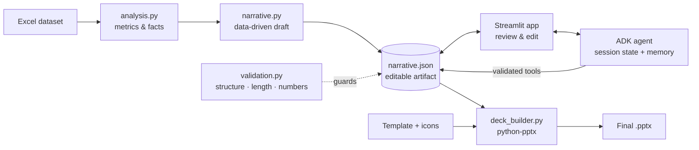

# NovaRetail QBR – AI-Assisted Executive Deck Generation (v2)

Generates the 5-slide NovaRetail Quarterly Business Review deck **programmatically** from the raw dataset,
filling the fixed template with python-pptx. **v2** adds a Google ADK agent with session memory, a Streamlit
review studio, and an editable narrative JSON step before deck assembly.

**Final deck:** [`output/NovaRetail_QBR_Executive_Deck.pptx`](output/NovaRetail_QBR_Executive_Deck.pptx)

## What's new in v2 (based on review feedback)

| Feedback | Implementation |
|---|---|
| Use **Google ADK** instead of a stateless LLM call | `src/agent.py` – `LlmAgent` + `Runner` + session service. The agent edits the deck only through validated function tools (`src/agent_tools.py`). |
| **Session state / memory** across interactions | The narrative, facts and revision log live in ADK session state, so every chat turn edits the same draft. Lasting style preferences are saved in the user-scoped key `user:preferences` and applied in every later session. Set `DECK_SESSION_DB` to keep them across restarts. |
| **Streamlit front end**: upload, review, chat, iterate, Generate Deck | `app.py` – upload the Excel file, review and edit every headline, bullet and action, chat with the agent (with quick prompts), then **Generate Deck** and download. |
| **Editable narrative JSON** before deck assembly | `output/narrative.json` (schema v2) is the only input to the deck builder. It can be viewed, edited, downloaded or uploaded in the app, or edited by hand and passed in with `--narrative`. |

Unchanged guarantees: KPI values are always computed in Python and locked (users and the AI can only edit labels).
Every edit, whether manual, from JSON or from the agent, is validated for structure, length, and **every number must
exist in the dataset**, so invented figures are blocked.

## Architecture



## Setup

```bash
python -m venv .venv
.venv\Scripts\activate            # macOS/Linux: source .venv/bin/activate
pip install -r requirements.txt
copy .env.example .env            # macOS/Linux: cp .env.example .env  -> add your GOOGLE_API_KEY or Vertex AI settings
```
Inputs go in `./inputs/`: `novaretail_template.pptx`, `novaretail_dataset.xlsx`, `novaretail_icon_repo.zip`.

## Run

| Goal | Command |
|---|---|
| Interactive studio (upload → review → chat → generate) | `streamlit run app.py` |
| Regenerate the deck from the data (no AI) | `python generate_deck.py` |
| Export the narrative only, edit it, then build | `python generate_deck.py --narrative-only` → edit `output/narrative.json` → `python generate_deck.py --narrative output/narrative.json` |
| Refine with the ADK agent from the CLI | `python generate_deck.py --llm adk --instruction "Make it more executive-friendly"` |
| ADK developer UI (see tool calls and session state) | `adk web agents` |
| List template shape names | `python generate_deck.py --inspect` |
| Tests | `python -m pytest -q` |

The studio works without an API key too: you can edit everything manually and generate the deck. Only the chat panel needs Gemini.

## Project structure

| File | Responsibility |
|---|---|
| `src/analysis.py` | Loads the 3 sheets, pivots region × quarter, computes KPIs and "who's winning / who's at risk" facts |
| `src/narrative.py` | Data-driven draft; narrative JSON schema (`to_json` / `from_json`) with locked KPI values; icon selection |
| `src/validation.py` | Structure, length and number-grounding checks used by the UI, the CLI and every agent tool |
| `src/agent_tools.py` | ADK function tools: `get_deck_context`, `update_text_section`, `update_bullets`, `update_actions`, `remember_preference`, `forget_preferences` |
| `src/agent.py` | ADK `LlmAgent`, instructions, `Runner`, session service, and the `DeckStudio` sync wrapper (start session, sync manual edits via `state_delta`, chat) |
| `src/pipeline.py` | Shared pipeline: initial session state, icon handling, validate + render |
| `src/deck_builder.py` | Finds named shapes, writes text, inserts native charts and icons, removes placeholders |
| `app.py` | Streamlit studio |
| `agents/deck_editor/` | `root_agent` for `adk web` |
| `generate_deck.py` | CLI |
| `shape_map.json` | Exact template shape names per slide |
| `tests/` | Unit and end-to-end tests (agent tools tested with a simulated ToolContext) |

## How the agent stays safe and stateful

1. **One draft, many turns.** On session start, the draft, the facts and the allowed numbers are written to ADK session state.
   Manual edits in the UI are pushed into the same session as a `state_delta` event before each chat turn, so the
   agent always works on what the user sees.
2. **Tools, not free text.** The agent can only change the deck by calling tools. Each tool validates the edit and
   returns `rejected` with reasons when it fails; the agent then corrects itself and retries.
3. **Memory.** Lasting preferences ("always keep bullets under 20 words") are stored in `user:preferences` and shown in
   the app. They apply to every session for that user id and can be cleared with one click.
4. **Audit trail.** Every change (system, user or agent) is written to `revision_log` and shown in the Revision history tab.

## Design decisions (v1)

* **Charts** – native, editable PowerPoint charts at the placeholder's exact position and size: clustered column
  (revenue), line (NPS) and line (stockout rate). Region colours are consistent across slides.
* **KPIs** – latest-quarter revenue, growth vs the first quarter in the data (true year-on-year isn't possible with 4 quarters),
  and revenue-weighted NPS.
* **Icons** – keyword-matched to each slide theme: globe_region, growth_chart, customer_star, risk_alert, lightbulb_action.
* **Clean-up** – dashed boxes and instruction text are removed; the run fails if any `[FILL]`/`[VALUE]` text remains.
